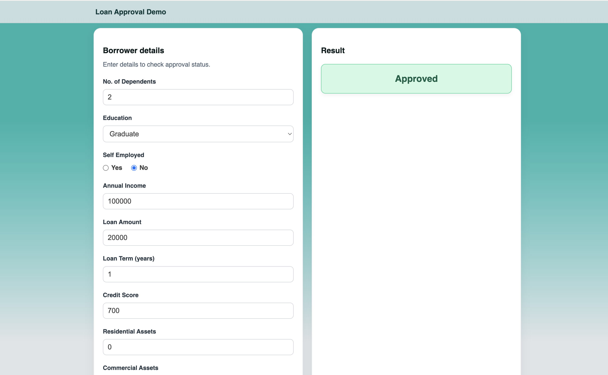

# 💸 Loan Approval Predictor  
Real-time loan approval prediction with explainable AI

---

## 🌐 Try It Live  
👉 [Check it out here](https://loanproval-app.netlify.app/)  
**Important:** If the site seems unresponsive at first, give it a minute — the backend (hosted on Render) may take a bit to spin up after long inactivity.

---

## What’s This?

A full-stack machine learning app that predicts whether your loan will be **approved or rejected** based on your personal and financial information.  
It's fast, smart, and built with real-world loan data from Kaggle!

---

## How It Works

### Machine Learning
- Model: **XGBoost Classifier**
- Trained on features like income, credit score, assets, and loan amount
- Achieves **99.3% accuracy** on test data

### Model Performance
- Accuracy: 99.3%
- F1-Score: 0.994 (Approved), 0.991 (Rejected)

## Tech Stack

| Layer       | Technology      |
|-------------|------------------|
| Frontend    | React (deployed on Netlify) |
| Backend     | FastAPI (hosted on Render) |
| ML Model    | XGBoost + Scikit-learn |
| Explainable AI | SHAP |
| Deployment  | Netlify + Render |
| Visualization | Matplotlib, SHAP |
